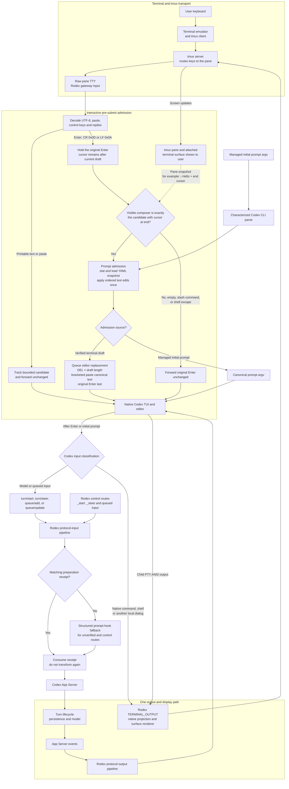

# Prompt submission flow

Rodex owns prompt admission. Codex owns its editor, optimistic history rendering, request
construction, and attachments. The App Server owns turns, persistence, and model events.
The preparation receipt joins the pre-Codex text transformation to the later structured
request without applying a non-idempotent YAML rule twice.

Ordinary draft characters cross tmux and Rodex immediately, so Codex has already rendered
the visible composer text when Enter arrives. The pane is raw: tmux transports CR or LF
but does not echo a visible Enter character. Rodex holds that byte while it drains pending
editor output and confirms the exact visible prefix and end cursor. At this point the
cursor remains after the draft on the current composer line; no submitted-history row or
new composer line exists yet.

For a verified draft, Rodex queues deletion, canonical bracketed-paste text, and the
user's original Enter in that order. This is an input-order guarantee, not a promise that
the canonical editor state will appear as a separately observable screen frame before
Codex consumes Enter. Codex nevertheless classifies, optimistically renders and submits
the canonical text. Its following primary request consumes the matching preparation
receipt rather than applying a potentially non-idempotent rule twice.

The former path began at `Codex TUI → RPC → structured prompt hook`. Codex had already
added the raw draft to optimistic history before the proxy could rewrite the RPC, so
display, model input and persistence could disagree. The corrected verified path moves
the edit ahead of native Enter. The structured boundary remains the fallback for
unverified editor state and the primary admission point for exact-control traffic.
