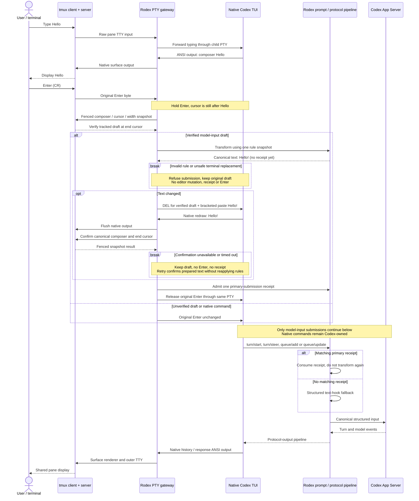

# Prompt submission: ownership and timing

The gateway owns the child PTY and release of Enter. Codex owns its editor and renders
all native draft/history text. The session interaction pipeline owns prompt rules and
one-use preparation receipts. tmux transports input and maintains the shared pane screen;
the App Server owns turns and persistence. **Production does not use `tmux send-keys`.**

## What the boundary establishes

The outer raw pane TTY receives input **before Codex receives Enter**. tmux does not
echo CR or first move the composer cursor to a new line. Ordinary typing has already
reached Codex; therefore replacing an already-rendered draft requires editor input.
The DEL bytes and bracketed paste go to the **child PTY**, not `send-keys`, terminal
scrollback surgery, or a second independent display writer. Codex performs the edit.

The ordered contract is **verify original → transform → edit → confirm canonical
output → admit receipt → release Enter**. Queueing replacement and Enter together
would establish byte order only; the gateway now drains child output and the outer
display queue before confirming the tmux pane. Confirmation recognizes ordinary `›`
and Ultra `»`, complete continuation rows, pane-width-compatible wrapping, and the
end cursor. A changed cursor/width, copy mode, retired runtime, partial draft or
collapsed paste cannot authorize the handoff. This is evidence from the native
rendered composer, not a private Codex editor API or acknowledgement that every remote
terminal client has physically painted its pixels.

The bounded handoff lasts up to 300 ms, with snapshot rechecks at at most 10 ms relay
wait intervals because tmux may consume output without another child-output event.
Individual fenced tmux calls retain their own deadlines. This is **not idle polling**.
This deadline starts at the Enter-triggered handoff, not at the first typed character:
a complete draft may remain idle for days in the same live runtime. Prompt rules are
read on submission, not frozen when typing begins.
Other keyboard input is not admitted during the handoff. A timeout after editing
keeps the canonical draft unsubmitted and unreceipted; Enter retries confirmation
without another hook application. Keys alone cannot revoke preparation: unchanged
canonical text consumes the same preparation, and only positive confirmation of a
different tracked draft returns to normal admission. An unavailable snapshot proves
neither case and keeps Enter held. After untracked native edits, clear and retype the
draft to recover a verifiable candidate; Rodex does not reconstruct Codex's editor.
A text rule cannot inject terminal controls, blank out the whole submission, or
acquire native slash/shell-command authority.

## Other entry points and limits

| Entry | Transformation and receipt ownership |
|---|---|
| Managed initial prompt argv | Characterized CLI parse → transform and admit → canonical argv; native initial text preserves surrounding whitespace. |
| Verified unchanged editor draft | Original confirmation → transform → admit composer-normalized text → original Enter; no unnecessary edit. |
| Verified changed editor draft | The two-confirmation PTY path above; receipt uses Codex's whitespace-trimmed submission text. |
| Unverified native draft | Forward unchanged to Codex; transform its later structured input. This fallback **does not guarantee matching optimistic TUI history**. |
| `_start`, `_steer`, queued/control input | Structured admission; these callers cannot consume the primary TUI's receipt. |
| Configured Rodex commands and menus | The terminal interceptor routes these to their registered interaction owner before prompt admission; handled local Enter is not forwarded as model input. |
| Native commands, approvals, attachments, other RPC fields | Remain native; text rules do not gain their authority. |

Unknown layouts, clipped/large collapsed pastes, and untracked editor operations are
not claimed as verified editor state. After a Rodex rewrite, Enter stays held unless
canonical output confirms or a positively verified different draft supersedes it.
There is no universal replacement of every tmux operation with PTY bytes: tmux still owns pane lifecycle,
capability-fenced reads, resize, attachment, status and its reserved keys.

## Root cause and regression evidence

Previously a structured-only rewrite occurred after Codex's optimistic history entry.
The first pre-Enter implementation still recognized only `›` on one row, so Codex
0.155.1 Ultra's `»` bypassed it. It also queued DEL, paste and Enter without checking
the resulting native frame, and reserved the receipt before that confirmation.
Those are distinct causes; replacing `send-keys` could not fix them because production
was already using the PTY.

`test_terminal_input.py` covers admission ordering, exactly-once retry, nonediting
events, intent/control-byte refusal and route-specific whitespace normalization.
`test_native_composer.py` and `test_input_interceptor_presentation.py` cover glyphs,
wrapping, literal arrow content, dimensions and snapshot fences.
`test_terminal_gateway.py` proves canonical output reaches an actual outer PTY before
Enter or receipt admission. `test_prompt_handoff_live.py` exercises installed Codex
0.155.1 and real tmux with isolated state: ordinary and Ultra greetings plus a wrapped
multiline rewrite, checking tmux history, App Server user-message events and Codex
input history. Its non-idempotent rule exposes accidental double transformation.

Manual acceptance on 2026-09-20 also confirmed both visible endpoints: typing `Hello`
produced `Hello!` in tmux history and in the assistant's received input. Submitting the
configured `push` shorthand during an active assistant turn delivered the full workflow
expansion, and the user confirmed that tmux displayed the same text. The expansion test
did not perform Git operations; publication was authorized separately afterward.

These are observed acceptance cases, not a claim that every native editor layout or
editing sequence can be verified. After code changes, a new `rodex` session loads the
new implementation; reattaching an existing runtime retains its loaded code.
