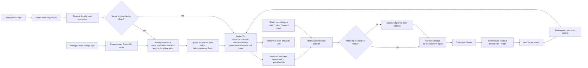

# Prompt submission flow

Rodex owns prompt admission. Codex owns its editor, optimistic history rendering, request
construction, and attachments. The App Server owns turns, persistence, and model events.
The preparation receipt joins the pre-Codex text transformation to the later structured
request without applying a non-idempotent YAML rule twice.

The former path began at `TUI → RPC → structured prompt hook`. Codex had already added
the raw draft to optimistic history before the proxy could rewrite the RPC, so display,
model input, and persistence could disagree. The corrected verified path moves the edit
to `TD → H → E`, before Codex classifies or renders the submission, while retaining the
structured boundary for exact-control traffic and editor states Rodex cannot safely
rewrite.
